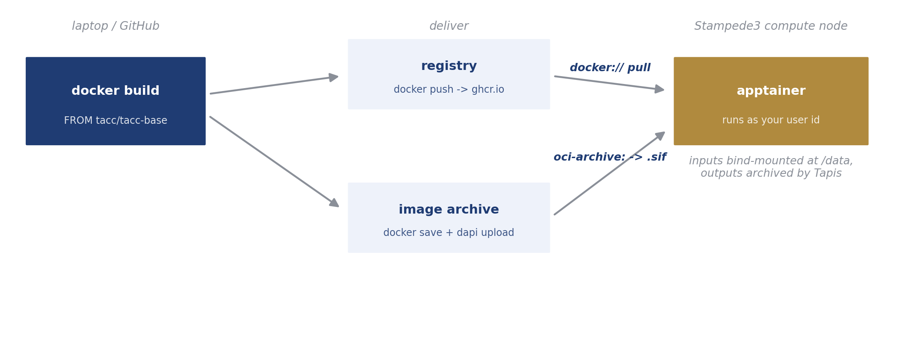

# Custom Containers

Run any software stack on Stampede3 by packaging it as a container image. No administrator is involved anywhere in the loop, and the image itself is never registered with Tapis; it stays a job parameter or an input file. For why containers on HPC work this way, and for apptainer versus Docker, see the [DesignSafe Workflows book](https://designsafe-ci.github.io/ds-workflows/containers).



The worked example takes a site-response analysis (numpy plus one script) from Dockerfile to archived results. The finished version, including everything below, is the [python-container-s3 repository](https://github.com/kks32/python-container-s3).

## Step 1. Write the Dockerfile

```dockerfile
FROM tacc/tacc-base:ubuntu22.04-impi19.0.9-common

COPY requirements.txt /opt/app/requirements.txt
RUN pip3 install --no-cache-dir -r /opt/app/requirements.txt

COPY app/ /opt/app/

CMD ["python3", "/opt/app/site_response.py"]
```

| Line | What it does | What you change |
|---|---|---|
| `FROM tacc/tacc-base:...` | Starts from TACC's Ubuntu 22.04 base with Intel MPI 19.0.9, so the toolchain matches the systems. | Pick another `tacc/tacc-base` tag (Ubuntu 20.04, Rocky 8, CUDA, MVAPICH) or any public base for serial code. The TACC bases matter when MPI inside the container must match the host fabric. |
| `COPY requirements.txt` + `RUN pip3 install` | Installs your Python dependencies at build time, so jobs never pip-install on the compute node. | List your packages in `requirements.txt`. Non-Python stacks use `apt-get install` or conda here instead. |
| `COPY app/ /opt/app/` | Bakes your analysis code into the image at a fixed path. | Put your scripts in `app/`. Code baked into the image is versioned with the image; code that changes per run belongs in the job's input directory instead. |
| `CMD [...]` | The default command, used when the job does not override it. | Point it at your entry script. Jobs can always run something else via the `COMMAND` parameter. |

The repository layout that goes with it:

```
python-container-s3/
├── Dockerfile
├── requirements.txt
├── app/
│   └── site_response.py
└── .github/workflows/build-push.yml   # Step 3
```

## Step 2. Build and test locally

Stampede3 is x86-64, so build for `linux/amd64` explicitly (required on Apple Silicon, harmless elsewhere), and run the container once before anything touches HPC.

```bash
docker build --load --platform linux/amd64 -t site-response .
docker run --rm site-response
```

A container that fails here fails on Stampede3 too, so fix it locally where the loop is seconds instead of a queue wait.

## Step 3. Publish the image

**With GitHub Actions (recommended).** Push the repository to GitHub with this workflow file, and every push builds the image and publishes it to GitHub Container Registry using the automatic `GITHUB_TOKEN`. No registry account or login exists anywhere.

```yaml
# .github/workflows/build-push.yml
name: build-and-push
on:
  push:
    branches: [main]
    tags: ["v*"]
permissions:
  contents: read
  packages: write
jobs:
  build:
    runs-on: ubuntu-latest
    steps:
      - uses: actions/checkout@v4
      - uses: docker/setup-buildx-action@v3
      - uses: docker/login-action@v3
        with:
          registry: ghcr.io
          username: ${{ github.actor }}
          password: ${{ secrets.GITHUB_TOKEN }}
      - uses: docker/metadata-action@v5
        id: meta
        with:
          images: ghcr.io/${{ github.repository }}
          tags: |
            type=raw,value=latest,enable={{is_default_branch}}
            type=semver,pattern={{version}}
      - uses: docker/build-push-action@v6
        with:
          context: .
          platforms: linux/amd64
          push: true
          tags: ${{ steps.meta.outputs.tags }}
```

After the first build, make the package public once (repository page, Packages, package settings, Change visibility) so compute nodes can pull it anonymously. The image is then

```
docker://ghcr.io/<owner>/<repo>:latest
```

**Without a registry.** Save the image as a tarball and upload it once with dapi; it stages to jobs like any input file. Recent Docker writes OCI layout, so the on-node conversion uses `oci-archive:`.

```bash
docker save site-response -o site-response.tar
```

```python
ds.files.upload("site-response.tar", f"{inputs_uri}/site-response.tar")
```

## Step 4. Register a container app, once

dapi ships the app as a template. `scaffold` writes the two app files, `deploy` uploads the wrapper and registers the app under your account. [Build your own app](apps.md#build-your-own-app) documents every field of both files.

```python
ds.apps.scaffold("my-container", template="container")
ds.apps.deploy("./my-container")
```

Skipping this step is fine for one-off runs. The [container-demo example](https://github.com/DesignSafe-CI/dapi/tree/main/examples/workflows/container-demo) runs the same image through the generic `python-s3` app with a short driver script instead; the app just removes that boilerplate.

## Step 5. Submit a job

The image and the command are job parameters. Everything else is an ordinary Tapis job.

```python
from dapi import DSClient

ds = DSClient()

inputs_uri = ds.files.to_uri("/MyData/site-response-inputs/")

job = {
    "name": "site-response",
    "appId": "my-container",
    "appVersion": "0.1.0",
    "execSystemLogicalQueue": "skx-dev",
    "nodeCount": 1,
    "coresPerNode": 1,
    "maxMinutes": 15,
    "fileInputs": [{"name": "Input Directory", "sourceUrl": inputs_uri}],
    "parameterSet": {
        "envVariables": [
            {
                "key": "CONTAINER_IMAGE",
                "value": "docker://ghcr.io/youruser/site-response:latest",
            },
            {"key": "COMMAND", "value": "python3 /opt/app/site_response.py"},
        ],
        "schedulerOptions": [{"name": "TACC Allocation", "arg": "-A MyAllocation"}],
    },
}
submitted = ds.jobs.submit(job)
submitted.monitor(interval=15)
```

For a staged tarball instead of a registry image, set `CONTAINER_IMAGE` to the tarball's filename (`site-response.tar`); the app converts it on the node. For a private registry image, add `APPTAINER_DOCKER_USERNAME` and `APPTAINER_DOCKER_PASSWORD` to `envVariables` rather than baking credentials into anything.

Inside the job, the command runs with `/data` as its working directory.

| Path in the container | What it is on the node | Notes |
|---|---|---|
| `/data` | the job's staged input directory | The command starts here. Files written here are archived. |
| `/opt/app` (or your `COPY` target) | the image, read-only | Rebuild the image to change it. |
| `/tmp` | node-local disk | Scratch during the run, gone afterwards. |
| `$HOME`, `$WORK`, `$SCRATCH` | host filesystems | Bound by TACC's apptainer configuration; see the [TACC containers guide](https://containers-at-tacc.readthedocs.io/). |

MyData and MyProjects are not mounted on compute nodes, so the container reads inputs only through the staged `/data`, and anything written outside a bound path vanishes with the container.

## Step 6. Collect results

```python
submitted.print_runtime_summary()
for item in ds.files.list(submitted.archive_uri + "/inputDirectory"):
    print(item.name)
submitted.download_output("inputDirectory/site_response.json", "site_response.json")
```

## Containers in workflows

A containerized job is an ordinary job, so it drops into a [DAG workflow](workflows.md) unchanged: a gmprocess study becomes a graph whose nodes fetch waveforms, process record shards in parallel containers (`docker://usgs/gmprocess`), and aggregate a report, each node sized to its own resources.
