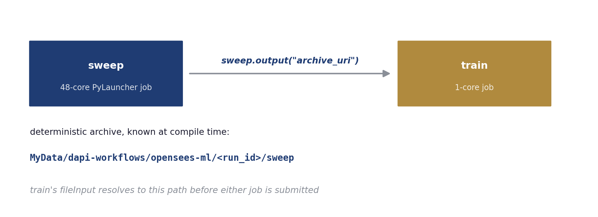
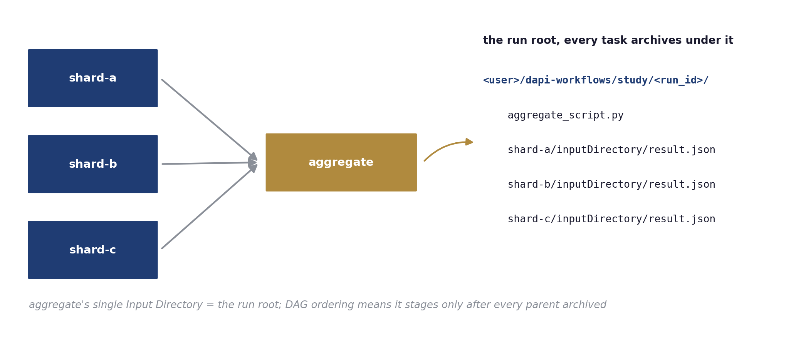

# Workflows

`dapi.workflows` chains Tapis jobs. You define each stage as a normal job and declare which stage needs the results of which; `run()` hands the graph to DesignSafe's workflow service, which submits every job on your behalf the moment the jobs it depends on finish. In the example on this page, a 48-core sweep runs first, and the one-core training job that reads its results is submitted automatically when the sweep completes. Stages that do not depend on each other run at the same time, and closing your notebook does not stop the run. Every job is a real Tapis job, on the same queues and against the same allocation as a job you submit by hand.



The concepts behind the design, and an interactive view of the scheduler, live in the [DesignSafe Workflows book](https://designsafe-ci.github.io/ds-workflows/dag-workflows).


## Step 1. Generate the job requests

Every workflow node is an ordinary job request from `ds.jobs.generate()`. Define each stage exactly as if it were a standalone job, sized to its own resources; the 48-core sweep and the 1-core trainer below are the [OpenSees ML example](examples/opensees_ml.md)'s two stages.

```python
from dapi import DSClient

ds = DSClient()

sweep_job = ds.jobs.generate(
    app_id="python-s3",
    input_dir_uri=staged_uri,
    script_filename="call_pylauncher.py",
    node_count=1,
    cores_per_node=48,
    max_minutes=30,
    queue="skx-dev",
    allocation=allocation,
)
train_job = ds.jobs.generate(
    app_id="python-s3",
    input_dir_uri="tapis://designsafe.storage.default/placeholder",  # replaced in Step 3
    script_filename="ml_post.sh",
    node_count=1,
    cores_per_node=1,
    max_minutes=15,
    queue="skx-dev",
    allocation=allocation,
    extra_env_vars=[{"key": "BINARY", "value": "bash"}],
)
```

## Step 2. Add the tasks to a workflow

You declare every dependency yourself; dapi never infers one from the order you add tasks.

```python
from dapi.workflows import Workflow, JobTask

wf = Workflow("opensees-ml")
sweep = wf.add(JobTask("sweep", job_dict=sweep_job))
train = wf.add(JobTask("train", job_dict=train_job), depends_on=["sweep"])
```

## Step 3. Wire outputs between tasks

A task references an upstream task's archive with `task.output()`. The reference does two things at once. dapi fills the train job's `sourceUrl` with the sweep's archive path, and it makes the train job wait for the sweep to finish, so the explicit `depends_on` above becomes optional.

```python
train_job["fileInputs"][0]["sourceUrl"] = sweep.output(
    "archive_uri", suffix="/inputDirectory"
)
train = wf.add(JobTask("train", job_dict=train_job))
```

dapi replaces the reference with a real path before it submits anything. Each run gives every task a fixed archive directory, `MyData/dapi-workflows/<workflow>/<run_id>/<task>`, so the sweep's archive location is known before the sweep ever runs, and the train job's `sourceUrl` is a concrete `tapis://` path from the start. The `suffix` selects a subfolder of the upstream archive, for example the `inputDirectory` a `python-s3` job archives its results into.

Only `archive_uri` can be referenced. A job's UUID or status does not exist before the run, so referencing them raises a validation error.

## Step 4. Validate, visualize, preview

`validate()` rejects cycles, duplicate task ids, and references to unknown tasks. `visualize()` draws the graph with every edge labeled by the output flowing across it, so a wiring mistake is visible before it costs a queue wait.

```python
wf.validate()
wf.visualize()
```


`compile()` shows exactly what a run will submit, one job definition per task with archives assigned and references resolved.

```python
tasks, archives = wf.compile(ds.tapis.username, run_id="preview")
print(tasks[1]["tapis_job_def"]["fileInputs"][0]["sourceUrl"])
# tapis://designsafe.storage.default/<you>/dapi-workflows/opensees-ml/preview/sweep/inputDirectory
```

## Step 5. Run and watch

```python
results = wf.run(ds)
```

While the run is active, `run()` streams timestamped status transitions for every task, so a notebook shows each node advance from submission through completion.

```
[18:12:10] pipeline 'opensees-ml-20260810-181209': submitted (2 tasks)
[18:12:41]   task sweep: created -> active
[18:12:41]   task train: created -> pending
[18:19:19]   task sweep: active -> completed
[18:19:19]   task train: pending -> active
[18:33:05]   task train: active -> completed
```

| Parameter | Default | Meaning |
|---|---|---|
| `run_id` | timestamp | Names this run's archive tree; pass one explicitly when a task needs the run root before `run()` |
| `poll_interval` | 30 | Seconds between status polls |
| `timeout_minutes` | 240 | Stop waiting after this long; the pipeline itself keeps running server-side |
| `progress` | `True` | Stream per-task transitions |

## Step 6. Collect results

`run()` returns a mapping from task id to `status`, `message`, and `archive_uri`. Every task's outputs sit at its deterministic archive path.

```python
ds.files.download(
    results["train"]["archive_uri"] + "/inputDirectory/ml_results/report.txt",
    "report.txt",
)
```

## Failure semantics

The service never submits a task whose upstream failed, and the `WorkflowExecutionError` that `run()` raises lists each task's state. A failed branch never cancels its siblings; independent branches run to completion, and their archives survive for a fixed rerun. Closing the notebook changes nothing; the service keeps executing the pipeline, and interrupting `run()` only stops the progress stream.

## Parallel branches and fan-in

The service submits tasks with no edges between them at the same time, each as its own job with its own resources. A downstream task that depends on all of them becomes the fan-in.

```python
wf = Workflow("regional-study")
a = wf.add(JobTask("shard-a", job_a))  # no edges between these three:
b = wf.add(JobTask("shard-b", job_b))  # all submitted at once
c = wf.add(JobTask("shard-c", job_c))
wf.add(JobTask("aggregate", agg_job), depends_on=["shard-a", "shard-b", "shard-c"])
```



Most DesignSafe apps, `python-s3` included, accept exactly one input directory (`strictFileInputs`), yet a fan-in needs every parent's output. All tasks of a run archive under one run root, so the aggregator's single input directory is the run root itself, and because `run()` submits the aggregator only after every parent has archived, Tapis stages that directory with every shard's results already in it. The app never changes. This is the **run-root pattern**. Choose the `run_id` yourself so the run root is known up front, and upload the aggregator's script into it before running.

```python
run_id = time.strftime("%Y%m%d-%H%M%S")
run_root = f"tapis://designsafe.storage.default/{ds.tapis.username}/dapi-workflows/regional-study/{run_id}"
ds.files.upload("aggregate.py", f"{run_root}/aggregate.py")
agg_job = ds.jobs.generate(app_id="python-s3", input_dir_uri=run_root,
                           script_filename="aggregate.py", ...)
...
results = wf.run(ds, run_id=run_id)
```

Inside the aggregator, each parent's outputs sit at `<task_id>/inputDirectory/`. The [pi fan-out example](https://github.com/DesignSafe-CI/dapi/tree/main/examples/workflows/pi_fanout) runs this exact shape on Stampede3. Three Monte-Carlo shards run in parallel, and the aggregator submits the moment the last shard finishes.

## Archive filters

By default a `python-s3` task archives its whole working copy, including the staged inputs, and fan-ins re-stage everything their parents archived. Add a Tapis `archiveFilter` to every workflow node so it archives only its result files.

```python
job["parameterSet"]["archiveFilter"] = {
    "includes": ["metrics.json", "**/metrics.json"],
    "includeLaunchFiles": False,
}
```

On the pi workflow, the filter cut the aggregator's archiving from 11.2 minutes to 41 seconds and the whole workflow from 27 to 16 minutes. Staging time did not shrink with volume; Tapis spends roughly the same time staging a directory whatever its size, so budget for that fixed cost when sizing many-node graphs.

## Fuse sequential steps into one job

Separate tasks each pay a queue wait. When a linear sequence of steps can share one node, `sequence_job()` packs the steps into a single `python-s3` job that runs them in order and fails at the first failing step. The result is an ordinary job request, so it can also serve as one node inside a larger graph.

```python
from dapi.workflows import sequence_job

fused = sequence_job(
    ds,
    steps=["python3 call_pylauncher.py", "bash ml_post.sh"],
    input_dir_uri=staged_uri,
    node_count=1,
    cores_per_node=48,
    max_minutes=45,
    queue="skx-dev",
    allocation="MyAllocation",
)
job = ds.jobs.submit(fused)
```

Choose the graph when stages need different resources or fan out; choose the fused job when they share a machine and always run together.

## Containers as workflow nodes

Tools that need their own software stack run as containers inside ordinary `python-s3` jobs, so they drop into a graph unchanged. Compute nodes pull registry images directly (`apptainer exec docker://usgs/gmprocess ...`), and you ship an unpublished image as a `docker save` tarball that Tapis stages like any input file and the driver script converts to SIF on the node. The [container-demo example](https://github.com/DesignSafe-CI/dapi/tree/main/examples/workflows/container-demo) is the working reference, including the driver script and its two sharp edges (load `tacc-apptainer` with `set -u` relaxed; recent Docker saves OCI layout, so convert with `oci-archive:`).

## Full example

The [OpenSees ML DAG notebook](examples/opensees_ml.md) runs a 75-simulation OpenSees sweep and a training job as a two-node workflow on Stampede3.
